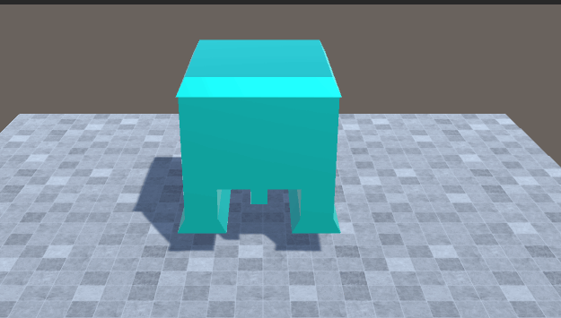

# Games103_hw_show
show Games103 hw pictures
 - 鉴于老师不让发源码，而且等改完所以老师会发参考答案，这里只发效果
 - 作业一：刚体碰撞旋转分别是impulse 和 shape matching 方法
 

 - 作业二: 隐式积分方法和pbd方法模拟布料
 
 

 
  - 作业三：软体有限元方法模拟 stvk模型 分别用直接的方法和SVD方法（SVD利于gpu）
 

 
 - 作业四: shallow wave 方法模拟水面
 
 